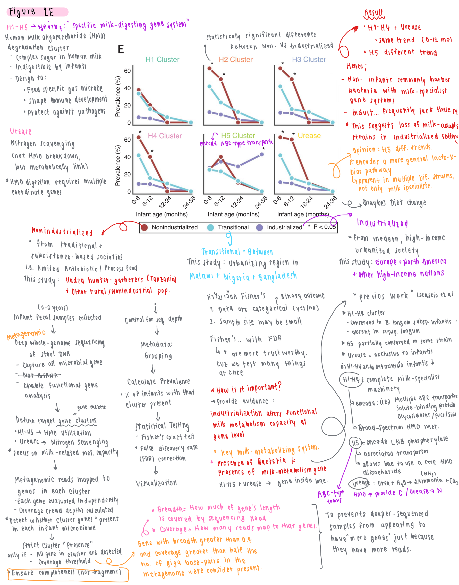

### Title: Robust variation in infant gut microbiome assembly across a spectrum of lifestyles (Figure 2E)

**Results**

The prevalence of gene clusters involved in human milk oligosaccharide (HMO) degradation (H1–H5) and urease-mediated nitrogen scavenging was analyzed across infant age groups and lifestyle categories (nonindustrialized, transitional, and industrialized).

Overall, most HMO-utilization clusters showed higher prevalence in nonindustrialized infants during early life (0–6 months) compared with industrialized infants. Specifically, H1, H2, H3, and H4 clusters were most prevalent in nonindustrialized infants and declined with increasing age across all lifestyle groups. Transitional populations exhibited intermediate prevalence levels between the two extremes.

A similar trend was observed for the urease cluster, which was significantly more prevalent in nonindustrialized infants during the first months of life and decreased with age.

In contrast, the H5 cluster displayed a distinct pattern. While its prevalence was relatively lower in early infancy among industrialized populations, it persisted longer and remained detectable beyond 12 months in industrialized infants compared with nonindustrialized populations.

Statistical testing indicated significant differences in prevalence between nonindustrialized and industrialized infants for several clusters during early infancy, highlighting lifestyle-associated variation in microbiome functional potential.

**Discussion**

The higher prevalence of HMO-degradation gene clusters (H1–H4) and urease in nonindustrialized infants suggests that their gut microbiomes are better equipped for metabolizing human milk oligosaccharides during early life. This likely reflects the greater presence of milk-adapted bacteria, particularly _Bifidobacterium infantis_, which possess specialized gene systems for efficient HMO utilization. In contrast, industrialized infants appear to lack many of these milk-specialist functions. The different pattern observed for the H5 cluster may be explained by its association with broader carbohydrate metabolism, as it encodes an ABC-type transporter present in multiple _Bifidobacterium_ strains rather than only milk specialists. Overall, these results suggest that lifestyle influences the functional capacity of the infant gut microbiome, particularly in pathways related to milk metabolism.

**Note:**

