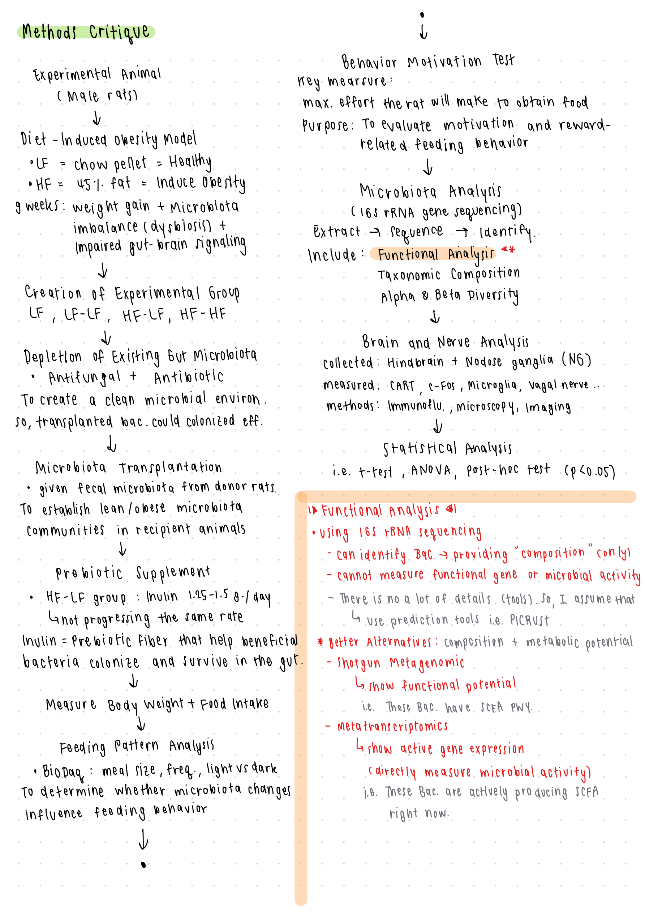

### Title: Transfer of microbiota from lean donors in combination with prebiotics prevents excessive weight gain and improves gut-brain vagal signaling in obese rats (Method Critique)

**Critique of Microbiota Functional Prediction Method**

The study analyzed gut microbiota composition using 16S rRNA gene sequencing targeting the V3–V4 region, which is commonly used to characterize bacterial communities. This approach allows identification of bacterial taxa and provides information on the relative composition and diversity of the microbial community. However, 16S rRNA sequencing has important limitations when used for functional prediction analysis. Specifically, this technique does not directly measure microbial functional genes, metabolic pathways, or microbial activity. Instead, functional predictions were inferred by comparing sequence similarity to the Kyoto Encyclopedia of Genes and Genomes (KEGG) database, likely through a computational prediction pipeline. Such predictions are based on known genomic information from reference organisms and therefore represent inferred functional potential rather than actual microbial gene expression or metabolic activity. Furthermore, the study provides limited detail on the functional prediction pipeline. Since KEGG pathway predictions were derived from 16S rRNA data, the authors may have used a tool such as PICRUSt, although this was not explicitly reported. Without clear description of the prediction method, it is difficult to assess the accuracy and reproducibility of the functional analysis.

I think a more robust approach to assess microbial functional capacity would be **shotgun metagenomic sequencing**, which sequences all microbial DNA and directly identifies functional genes and metabolic pathways present in the microbiome. Additionally, **metatranscriptomic analysis** could provide insight into actively expressed microbial genes, allowing researchers to evaluate microbial metabolic activity rather than predicted potential. These methods would provide a more accurate representation of microbial function and strengthen conclusions regarding microbiota-mediated metabolic effects.

**Note:**

