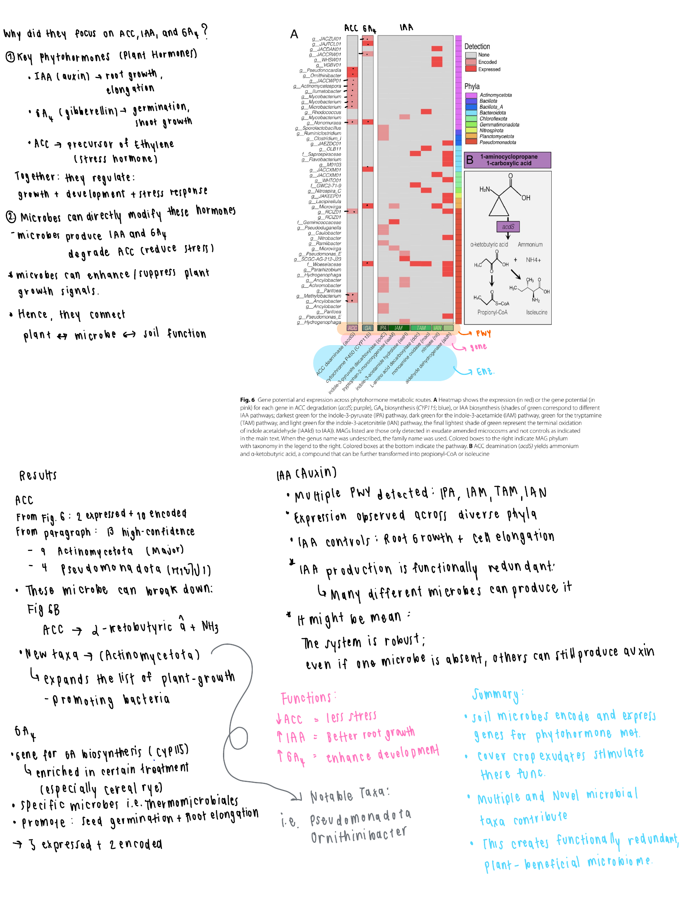

### Cover crop root exudates impact soil microbiome functional trajectories in agricultural soils (Figure 6)

**Results**

First, they identified **13 MAGs encoding the acdS gene**, which catalyzes the deamination of ACC into α-ketobutyric acid and ammonia. These MAGs were primarily affiliated with **Actinomycetota (9 MAGs)** and **Pseudomonadota (4 MAGs)**. Importantly, prior evidence for ACC deamination is well established in Pseudomonadota, but **not in Actinomycetota**, indicating previously unrecognized functional capacity in this phylum. In addition to genomic potential, the study used metatranscriptomics to show that these genes were **actively expressed**, indicating that ACC degradation is not just possible but occurring in the soil microcosms.

Second, for **IAA biosynthesis**, the authors detected that: *215 MAGs encoded at least one gene* in IAA pathways and *29 MAGs actively expressed IAA-related genes*. They identified four out of five known tryptophan-dependent IAA pathways, with notable expression patterns:
- TAM pathway: ~20–33% expression (DDC, MAO genes)
- IAN pathway: ~33% expression (nitrilase)
- IAM pathway: ~7% expression (iaaM, iaaH)
It indicates a shift away from classical IAM/IPA pathways toward TAM and IAN pathways in these soils.

Third, for **gibberellin (GA4) biosynthesis**, the study identified: 1. Expression of key genes including **CYP115**, required for bioactive GA₄ production 2. Enrichment of these genes specifically in cereal rye exudate treatments 3. Likely contributors included *Thermomicrobiales (Chloroflexota)* MAGs

**Discussion**

These findings provide strong evidence that **root exudates drive functional restructuring of the soil microbiome**, particularly in pathways directly linked to plant physiology. For **ACC metabolism**, the presence and expression of acdS genes across diverse taxa suggests that ACC consumption is a widespread microbial function in these systems. Since ACC is the precursor to ethylene, a hormone associated with plant stress, microbial degradation of ACC can provide lower ethylene levels, enhance plant stress tolerance, and promote root growth. **For IAA biosynthesis**, the authors highlight that multiple pathways are both encoded and expressed across phylogenetically diverse microbes. This demonstrates functional redundancy, meaning: 1. Different taxa can perform the same function 2. The system is resilient to perturbations. **For gibberellin production**, the enrichment of GA4 biosynthesis genes in cereal rye treatments indicates that specific exudate chemistries selectively stimulate particular microbial functions. The involvement of relatively understudied taxa such as Thermomicrobiales further supports the idea that key functional players in soil ecosystems remain undercharacterized.

Overall, Figure 6 provides direct evidence that root exudates shape not just who is in the soil microbiome, but what they are doing, specifically driving microbial processes that regulate plant hormone dynamics and plant performance.

**Note:**

